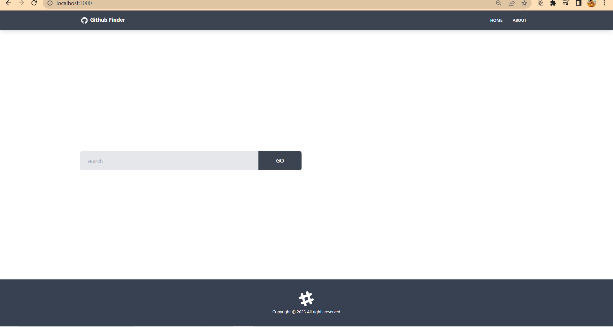
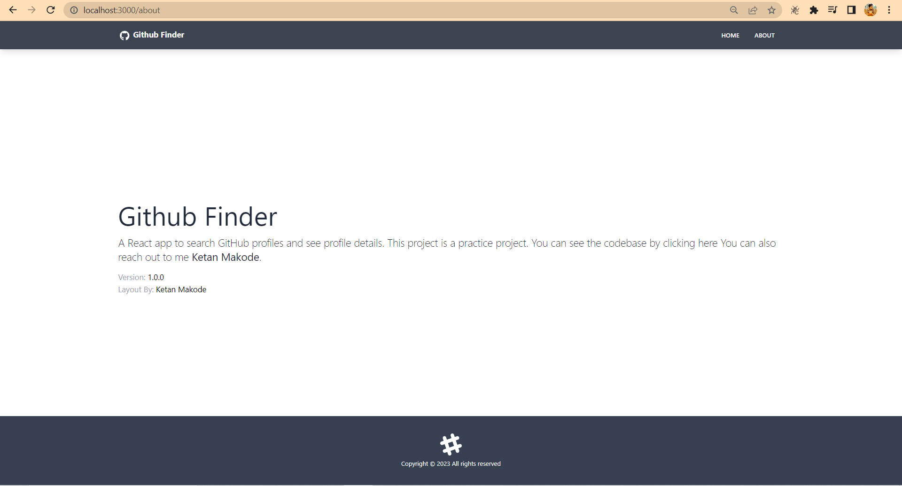
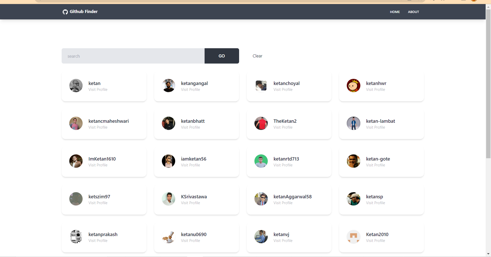
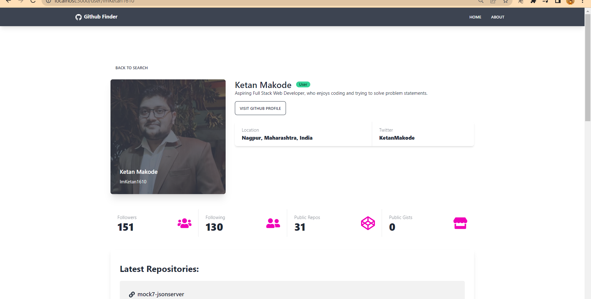

# Github Finder

Practice project

## Type-of-Project

Solo Project

## Welcome :wave:

### Home Page

### About Page

### Search Page

### Visit Page

### About This App:

> It is simple app, built using React, HTML and CSS. Also used github api for the required data and rendered the data on pages with the help of React.
> Used tailwind css for the styling.

### Tech Stack Used

- HTML
- CSS
- React

### Live Link

[Github Finder Clone](https://)
